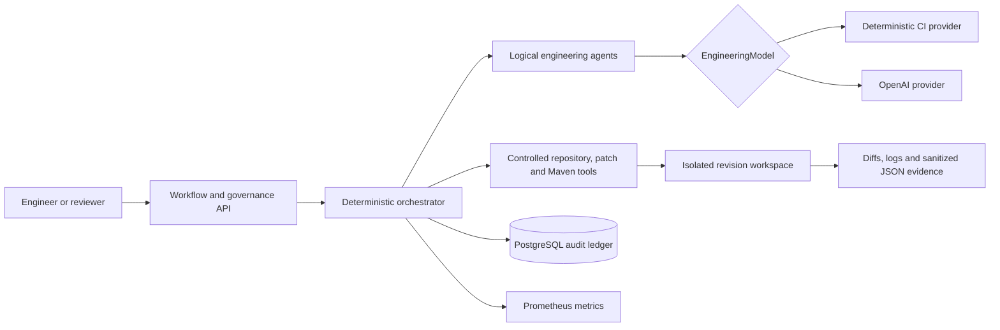
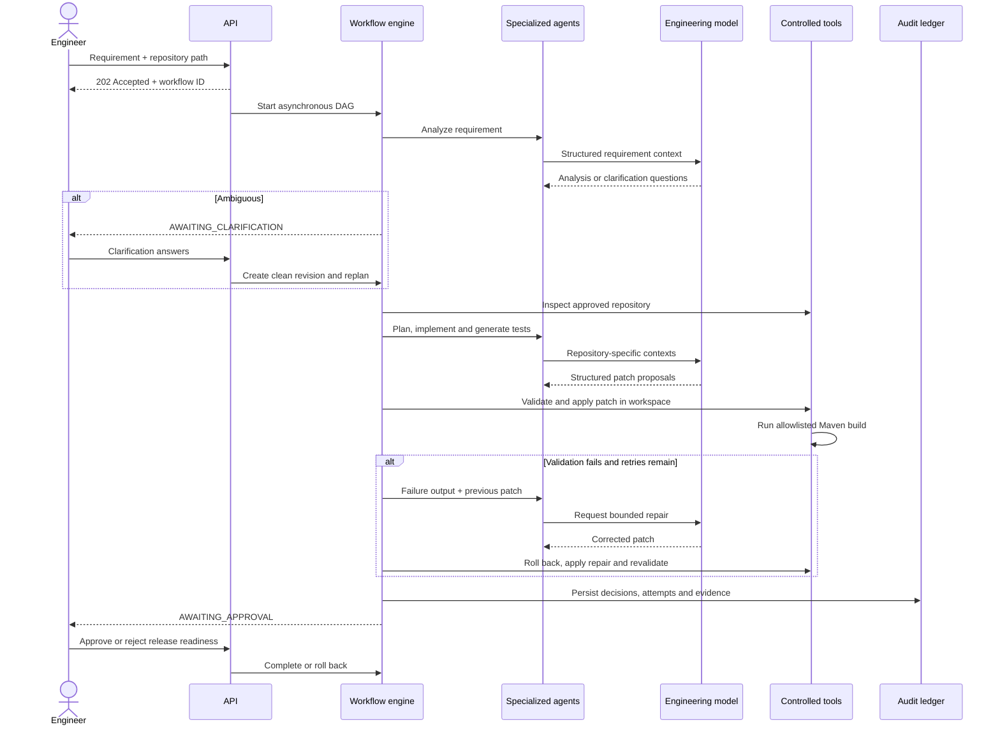

# Architecture

## Purpose

Agentic Software Engineer converts a natural-language engineering requirement
and an approved greenfield seed or brownfield repository into a generated,
tested and reviewable
software change. Model reasoning is deliberately separated from deterministic
execution controls: agents decide what to propose, while Java policy code
decides what may be read, written, executed, retried, approved or rolled back.

## System context

## Agentic execution sequence

## Components and responsibilities

| Component | Responsibility |
|---|---|
| Workflow API | Creates asynchronous workflows and exposes current state |
| Governance API | Accepts clarification, approval, rejection and safe-stop decisions |
| Workflow engine | Executes dependency waves, evaluates gates and owns state transitions |
| Requirement agent | Normalizes intent, acceptance criteria, ambiguities, assumptions and risks |
| Repository agent | Uses controlled search/read tools to build brownfield context |
| Scenario strategy | Carries `GREENFIELD`, `BROWNFIELD` or `AMBIGUOUS` through repository context so downstream agents select real scenario behavior |
| Architecture agent | Produces a dependency-aware engineering plan |
| Implementation agent | Proposes structured production-file changes |
| Testing agent | Proposes acceptance-criteria-driven tests |
| Repair agent | Uses bounded build failure output to correct a failed patch |
| EngineeringModel | Provider-neutral reasoning contract implemented by deterministic and OpenAI providers |
| Patch service | Enforces path, size, hash and operation policies before filesystem writes |
| Maven build tool | Runs only the repository wrapper with fixed arguments and timeout |
| Workspace service | Copies approved repositories, snapshots revisions and verifies rollback |
| Audit service | Redacts secrets and persists agent/tool/governance lineage and evidence |

## Trust boundaries

Repository contents and model output are untrusted. They cross deterministic
validation boundaries before affecting the workspace:

1. The submitted repository path must be relative to the configured approved
   root and must resolve beneath its real filesystem path.
2. Symlinks, oversized repositories and oversized files are rejected.
3. Proposed changes must use supported operations and normalized paths beneath
   the isolated repository.
4. Updates and deletes require the expected SHA-256 hash, preventing stale or
   unintended writes.
5. The only executable build command is the repository Maven wrapper with the
   fixed `clean test` argument list.
6. Process time, output size, patch size, file count, concurrent workflows and
   repair attempts are bounded.
7. Credentials are injected through environment variables and redacted before
   audit evidence is stored.

## State and data

- Active workflow/task state is held in a concurrency-safe in-memory repository.
- Audit lineage and sanitized evidence content are durable in PostgreSQL.
- Each workflow revision has an isolated directory containing a repository
  copy, immutable baseline snapshot, artifacts and build logs.
- A clarification creates a new revision and cannot consume stale context from
  the previous revision.
- Safe stop cancels pending/running tasks, terminates an active Maven process
  and restores the current revision from its baseline.

The in-memory workflow store is a documented assessment boundary: after a
process restart, historical evidence remains queryable, but an interrupted
workflow cannot resume. A production extension would persist workflow and task
state using optimistic locking and lease-based workers.

## Model provider strategy

`EngineeringModel` keeps orchestration independent of a model vendor.

- `deterministic` is the default test double. It provides stable offline CI and
  a repeatable URL-analytics/repair demonstration.
- `openai` performs live requirement interpretation, planning, source/test
  generation and repair with schema-constrained responses.

The deterministic provider does not pretend to solve arbitrary requirements;
it proves the controlled execution system. The OpenAI provider supplies the
general reasoning path, and its HTTP boundary is contract-tested without a
paid key.

## Failure handling

| Failure | Behavior |
|---|---|
| Ambiguous requirement | Pause and request clarification |
| Invalid path or patch | Reject before filesystem mutation |
| Build failure | Supply bounded output to repair agent and retry |
| Retry exhaustion | Roll back, verify baseline and fail workflow |
| Human rejection | Roll back and mark `REJECTED` |
| Safe stop | Terminate build, cancel tasks, roll back and mark `SAFE_STOPPED` |
| Invalid transition | Return RFC 9457-style Problem Details with HTTP 409 |

## Deployment

The container runs as an unprivileged user with all Linux capabilities dropped,
a read-only root filesystem, writable `/tmp`, workspace and Maven-cache mounts,
and readiness health checks. A JDK and warmed Maven cache are intentionally
included because validating generated Java projects is a runtime platform
capability.

GitHub Actions runs the Maven verification lifecycle, enforces JaCoCo line
coverage, uploads test/coverage reports and builds the production image. CI uses
the deterministic provider and therefore requires neither network model calls
nor model credentials.
